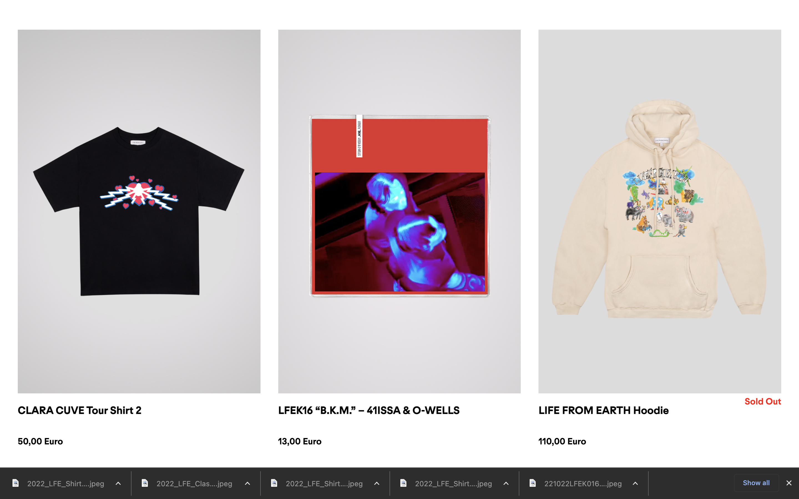
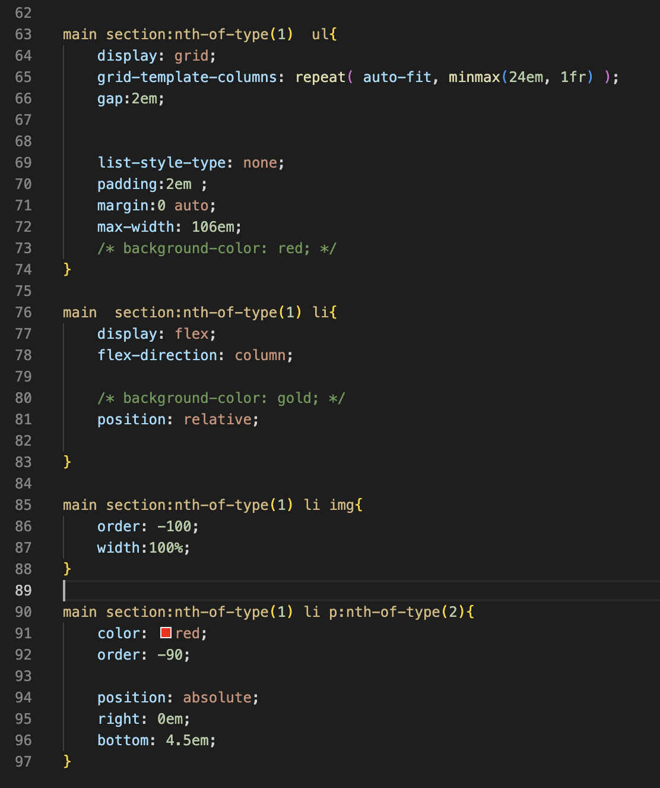
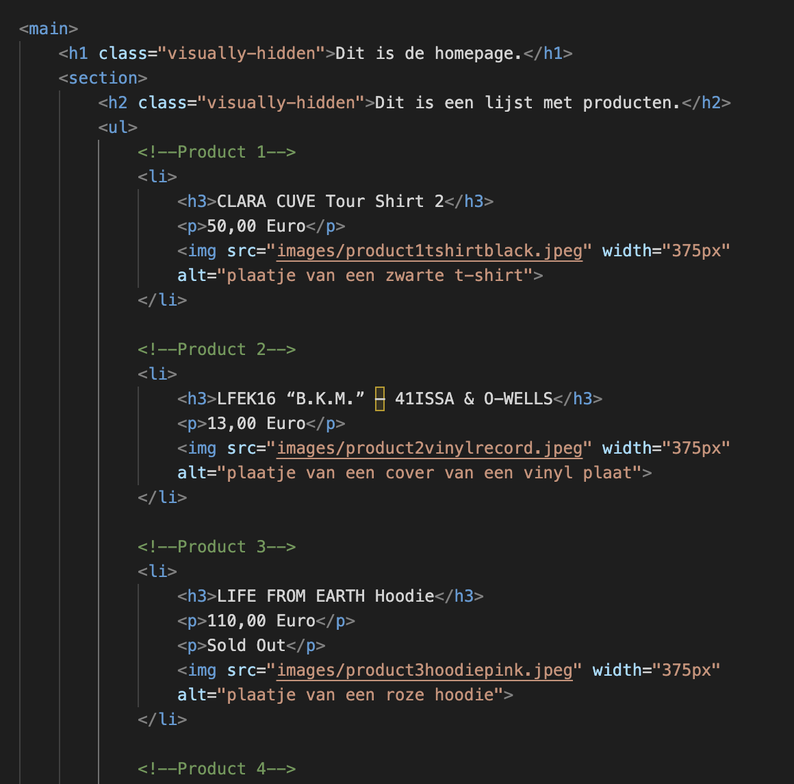
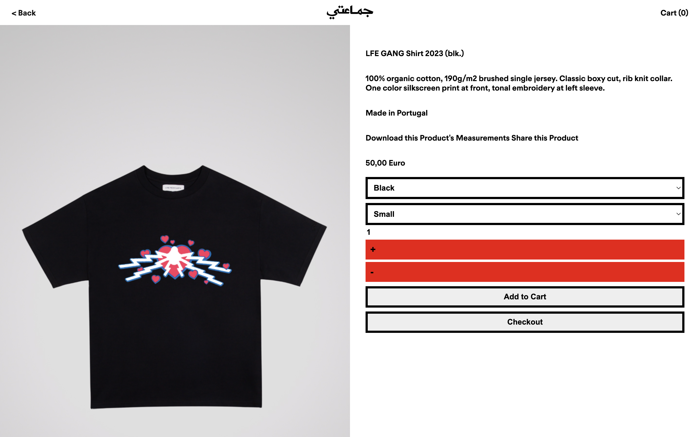

# Procesverslag
Markdown is een simpele manier om HTML te schrijven.  
Markdown cheat cheet: [Hulp bij het schrijven van Markdown](https://github.com/adam-p/markdown-here/wiki/Markdown-Cheatsheet).

Nb. De standaardstructuur en de spartaanse opmaak van de README.md zijn helemaal prima. Het gaat om de inhoud van je procesverslag. Besteedt de tijd voor pracht en praal aan je website.

Nb. Door *open* toe te voegen aan een *details* element kun je deze standaard open zetten. Fijn om dat steeds voor de relevante stuk(ken) te doen.

## Jij

  
uitwerken voor kick-off werkgroep

  ### Auteur:
  Kenneth Combee

  #### Je startniveau:
  Blauw

  #### Je focus:
  Responsive
 

## Je website

  
uitwerken voor kick-off werkgroep

  ### Je opdracht:
  https://www.livefromearth.shop/

  #### Screenshot(s) van de eerste pagina (small screen): 
  hier de naam van de pagina  
  

  #### Screenshot(s) van de tweede pagina (small screen):
  hier de naam van de pagina  
  
 

## Toegankelijkheidstest 1/2 (week 1)

  
uitwerken na test in 1e werkgroep

  ### Mijn bevindingen Campina website van Redouan:

  #### Screenreader
  Toegankelijkheid test Campina homepage

  Wat valt op screenreader:
  Door middel van de rotor kun je selecteren op welk onderdeel je wilt zoeken met de voice over (FOTO ROTOR google)

  Screenreader heading:
  Geeft aan of het h1,h2, h3 of h4 is
  Op Campina home is de menu banner h2
  H3 zijn de kopjes in de footer.
  Geeft aan dat je op de laatste heading bent als je helemaal naar beneden scrollt

  Screenreader links: 
  Veel links op de pagina van Campina. Interessante is dat die zelfs door de links in de dropdown van de menu items heengaat, deze zijn niet zichtbaar tenzij je over de menu items hoverd. Apart maar dit kan voor een blinde denk ik wel handig zijn om te zien wat er allemaal in de navigatie zit.
  Geeft aan dat dat ‘first link’ in de UPS bar zit.

  Zo ziet de rotor er in de UI uit:

  

  #### Muis en Toetsenbord 
  Bediening, wat valt op:
  Kan alleen door de site navigeren door te tabben en dit gaat alleen naar beneden. Het is dus niet mogelijk op met de pijltjes naar links en rechts te navigeren.
  Door de pijltjes te gebruiken of spatie kun je scrollen op de pagina.

  Volgorde, wat valt op:
  De volgorde gaat door de lists heen. In de footer gaat dat van boven naar beneden
  Op de producten pagina gaat de volgorde door de list heen wel horizontaal.
  Ook ga je door deze manier van navigeren weer door alle submenu items die niet zichtbaar zijn.

  State, wat valt op:
  Active state word getoond als iets geselecteerd is door middel van te tabben. Hover en focus niet.

  #### Motoriek (shocks, elastiekjes)
  Slechte motoriek:
  Elastieken om je vingers nemen de vrijheid weg die je gewent bent door al je verschillende vingers een andere kant op te laten bewegen. Hierdoor ben je een stuk minder snel met typen.

  Concentratieprobleem:
  Hier kan ik niet veel over te zeggen.

  Spasmes:
  Erg genoten van de EMS Spierstimulator, mooi dat zoiets mag worden toegepast op studenten. Alleen kunnen de effecten wel zo heftig zijn dat je bijna geen gebruik kan maken van bijvoorbeeld een computer.

  ()

  #### Visueel (brillen, contrast, kleurenblind, dark/light). 
  Brillen:
  Verschillende vormen visuele beperkingen zijn te ervaren door deze brillen:

  

  Hier een voorbeeld van als je door de 'blurry bril' kijkt:

  

  Kluerenblind:
  De Campina branding (groene kleur) komt niet terug bij verschillende soorten van kleurenblindheid maar alle elementen zijn nog wel te zien en te begrijpen
  Voorbeeld van de Campina website als je de visuale beperking 'Protanopia' hebben:

  

  Voorbeeld van de Campina website als je de visuale beperking 'Tritanopia' zou hebben:

  

  Dark/light-mode:
  Er is geen dark-mode beschikbaar vanuit de browser en er is ook geen toggle om dark-mode aan te zetten op de website zelf.

### Redoun z'n bevindingen voor mijn website (Live From Earth Shop):

  -Voice over-
  Bevinding 1: De homepagina van de website bevat geen headings. Deze staan niet als optie in de Rotor.
  Bevinding 2: Op de homepagina zijn de linkjes vrij duidelijk. Vooral omdat (bijna) alle content hierop linkjes zijn.
  Bevinding 3: De links zijn ook de titels.

  -Toetsenbord & muis-
  Bevinding 1: De tab gaat wel logisch door alle elementen heen. Maar je kunt niet zien op welke element je zit.
  Bevinding 2: Bij de producten pagina is het niet alleen dat je niet de tab selecgie ziet. Maar de volgorde van de tab navigatie gaat is niet logisch. Het is ook ondeuidelijk waar het begint en eindigt.

## Breakdownschets (week 1)

  
uitwerken na afloop 2e werkgroep

  ### de hele pagina: 
  

  ### dynamisch deel (bijv menu): 
  

  ### wellicht nog een dynamisch deel (bijv filter): 
  

## Voortgang 1 (week 2)

  
uitwerken voor 1e voortgang

  ### Stand van zaken
  hier dit ging goed & dit was lastig (neem ook screenshots op van delen van je website en code)

  ### Agenda voor meeting
  samen met je groepje opstellen

  Chelsey:
  website: starbucks.nl

  Mauro:
  website: garagenoord.com
  tekst langs de zijkant laten bewegen; writing-mode & marquee

  Stein:
  website: spoorwegmusuem.nl

  Kenneth:
  website:livefromearth.shop
  Ben geholpen met de opzet van m'n html

  ### Verslag van meeting
  hier na afloop snel de uitkomsten van de meeting vastleggen

  - HTML opzet
  - Sanne heeft na afloop nog eventjes geholpen
  - 

## Voortgang 2 (week 3)

  
uitwerken voor 2e voortgang

  ### Stand van zaken
  hier dit ging goed & dit was lastig (neem ook screenshots op van delen van je website en code)

  Ben blij hoe het gaat, leetste tijd niet echt aan kunnen werken (persoonlijke situatie en werk)
  Hoop zo snel mogelijk de homepage af te hebben.
  Wat hab ik nog nodig:
  - Header
  - Footer

  Wat ik tot nu toe heb:

  

  

  

  ### Agenda voor meeting
  Vragen zijn gedeeld in Teams

  Chelsey:
  Ordered list in de list item zetten

  Mauro:
  Font erin gezet, maakt een groot verschil

  Stein:
  Video in de website gezet

  Kenneth:
  Responsive catologus (ul) in display grid. List item in display flex. SOLDOUT absolute gepositioneerd.

  ### Verslag van meeting
  hier na afloop snel de uitkomsten van de meeting vastleggen

  - div mag als Sanne en Stein het goed vinden 
  - 
  - 

## Toegankelijkheidstest 2/2 (week 4)

  
uitwerken na test in 8e werkgroep

  ### Mijn bevindingen SpaceX website van Joep:

  #### Screenreader
  Screenreader heading:
  Geeft op mijn laptop niet aan wat de headings zijn maar bij Joep wel. (Misschien iets met mijn instellingen)

  Screenreader links: 
  Links zijn goed aangegeven met state(visited) en titel

  #### Muis en Toetsenbord 
  Bediening:
  Navigeren kan naar links en rechts door gebruik te maken van de pijltjes.
  Met tab alleen naar rechts.

  Button states zijn goed uitgewerkt.

  #### Visueel (brillen, contrast, kleurenblind, dark/light). 
  Kleuren:
  Blurred: Moeilijk leesbaar.
  Pratonopia, Deuteranopia, Tritanopia, Achromatopsia: Goed zichtbaar en leesbaar.

  Dark/light-mode:
  Is niet uitgewerkt.

  #### Motoriek (shocks, elastiekjes)
  Slechte motoriek:
  Elastieken om je vingers nemen de vrijheid weg die je gewent bent door al je verschillende vingers een andere kant op te laten bewegen. Hierdoor ben je een stuk minder snel met typen.

  Visuele beperkingen
  Verschillende vormen visuele beperkingen zijn te ervaren door deze brillen:

  Concentratieprobleem:
  Story of my life

  Spasmes
  Erg genoten van de EMS Spierstimulator, mooi dat zoiets mag worden toegepast op studenten. Alleen kunnen de effecten wel zo heftig zijn dat je bijna geen gebruik kan maken van bijvoorbeeld een computer.

## Voortgang 3 (week 4)

  
uitwerken voor 3e voortgang

  ### Stand van zaken
  Bijna klaar. Nog wat details uitwerken die niet helemaal meewerken (:root etc.)
  Verder alleen nog een interactie uitwerken mat javascript.

  Ben blij dat het tot dusver aardig gelukt is en dat ik alles tot op zekere hoogte goed gebrijp.

  

  ### Agenda voor meeting
  samen met je groepje opstellen

  Chelsey:
  (is afwezig)

  Mauro:
  Body heeft standaard margin; is nu weggehaald.

  Stein:
  Weet het allemaal wel.

  Kenneth:
            Vragen: 
            - :root colors werken op de ene plek wek, op de andere niet.
            - flexbox werktniet lekker bij de buttons in de form, komt denk ik doordat daaronder het een en ander overschrijf. 
            - Form responsiveness... ..> media queries
            - JavaScript voor de + en - van een product

  ### Verslag van meeting
  hier na afloop snel de uitkomsten van de meeting vastleggen

  - JavaScript enigszins geleerd
  - 1. Bijna klaar, flex box fixen in de vorm
  - 2. Media querie fixen

## Eindgesprek (week 5)

  
uitwerken voor eindgesprek

  ### Je uitkomst - karakteristiek screenshots:
  

  ### Dit ging goed/Heb ik geleerd: 
  Korte omschrijving met plaatjes

  Veel ging beter dan ik had verwacht en ik begrijp de stof beter dan ik had verwacht. Maar dit keer wou ik het gewoon veel meer dan voorgaande jaren.
  De afgelopen weken heb ik in de les m'n best gedaan en vervolgens thuis, voor de volgende les, zover mogelijk komen met wat ik had geleerd en wat ik op het internet opzocht. Waar ik niet uit kwam bewaarde ik voor de volgende les waar ik goed geholpen werd door Sanne en zijn assistent. Dit herhaalde ik elke week en ik ben ook vaak extra langs na de les blijven zitten om zoveel mogelijk te leren en zover mogelijk te komen met het bouwen van de website.

  Hier het visuele resultaat:
  

  ### Dit was lastig/Is niet gelukt:
  Korte omschrijving met plaatjes

  Ik vond JavaScript nog wel lastig om te begrijpen. Ik ben bang dat ik de JS les heb moeten missen vanwege een Kick-Off voor afstuderen maar gelukkig was Sanne daar om me op weg te helpen tijdens en na het laatste voortganggesprek.

  

## Bronnenlijst

  
continu bijhouden terwijl je werkt

  Nb. Wees specifiek ('css-tricks' als bron is bijv. niet specifiek genoeg).

  1. Css tricks flexbox
  2. Css tricks flexbox
  3. Youtube HTML form styling

