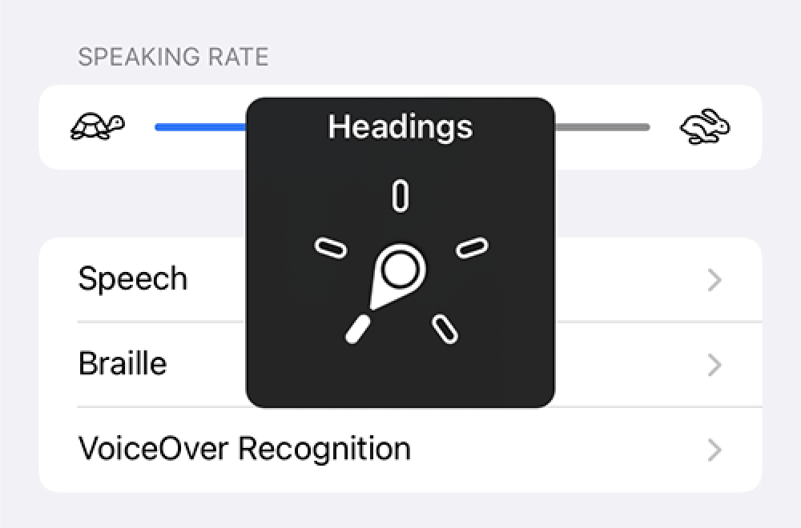
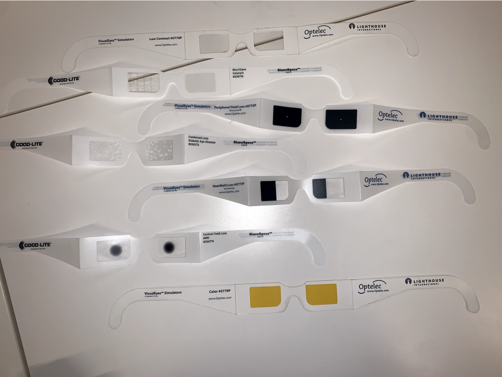
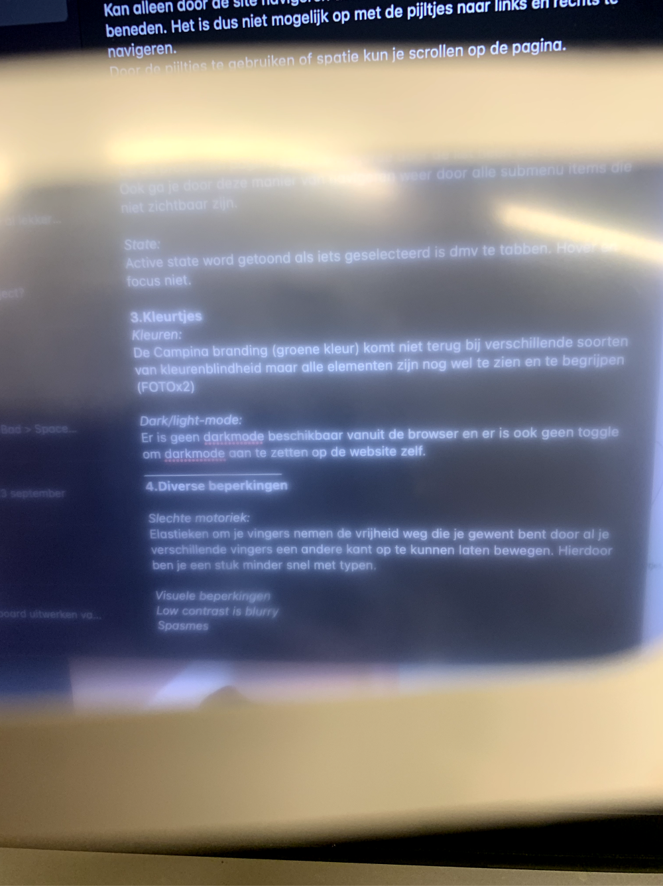
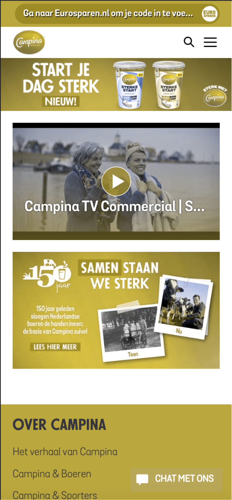
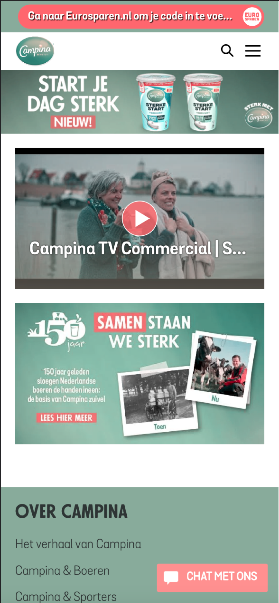

# Procesverslag
Markdown is een simpele manier om HTML te schrijven.  
Markdown cheat cheet: [Hulp bij het schrijven van Markdown](https://github.com/adam-p/markdown-here/wiki/Markdown-Cheatsheet).

Nb. De standaardstructuur en de spartaanse opmaak van de README.md zijn helemaal prima. Het gaat om de inhoud van je procesverslag. Besteedt de tijd voor pracht en praal aan je website.

Nb. Door *open* toe te voegen aan een *details* element kun je deze standaard open zetten. Fijn om dat steeds voor de relevante stuk(ken) te doen.

## Jij

  
uitwerken voor kick-off werkgroep

  ### Auteur:
  Kenneth Combee

  #### Je startniveau:
  Blauw

  #### Je focus:
  Responsive
 

## Je website

  
uitwerken voor kick-off werkgroep

  ### Je opdracht:
  https://www.livefromearth.shop/

  #### Screenshot(s) van de eerste pagina (small screen): 
  hier de naam van de pagina  
  

  #### Screenshot(s) van de tweede pagina (small screen):
  hier de naam van de pagina  
  
 

## Toegankelijkheidstest 1/2 (week 1)

  
uitwerken na test in 1e werkgroep

  ### Bevindingen

  #### Screenreader
  Toegankelijkheid test Campina homepage

  Wat valt op screenreader:
  Door middel van de rotor kun je selecteren op welk onderdeel je wilt zoeken met de voice over (FOTO ROTOR google)

  Screenreader heading:
  Geeft aan of het h1,h2, h3 of h4 is
  Op Campina home is de menu banner h2
  H3 zijn de kopjes in de footer.
  Geeft aan dat je op de laatste heading bent als je helemaal naar beneden scrollt

  Screenreader links: 
  Veel links op de pagina van Campina. Interessante is dat die zelfs door de links in de dropdown van de menu items heengaat, deze zijn niet zichtbaar tenzij je over de menu items hoverd. Apart maar dit kan voor een blinde denk ik wel handig zijn om te zien wat er allemaal in de navigatie zit.
  Geeft aan dat dat ‘first link’ in de UPS bar zit.

  Zo ziet de rotor er in de UI uit:

  

  #### Muis en Toetsenbord 
  Bediening, wat valt op:
  Kan alleen door de site navigeren door te tabben en dit gaat alleen naar beneden. Het is dus niet mogelijk op met de pijltjes naar links en rechts te navigeren.
  Door de pijltjes te gebruiken of spatie kun je scrollen op de pagina.

  Volgorde, wat valt op:
  De volgorde gaat door de lists heen. In de footer gaat dat van boven naar beneden
  Op de producten pagina gaat de volgorde door de list heen wel horizontaal.
  Ook ga je door deze manier van navigeren weer door alle submenu items die niet zichtbaar zijn.

  State, wat valt op:
  Active state word getoond als iets geselecteerd is door middel van te tabben. Hover en focus niet.

  #### Motoriek (shocks, elastiekjes)
  Slechte motoriek:
  Elastieken om je vingers nemen de vrijheid weg die je gewent bent door al je verschillende vingers een andere kant op te laten bewegen. Hierdoor ben je een stuk minder snel met typen.

  Concentratieprobleem:
  Hier kan ik niet veel over te zeggen.

  Spasmes:
  Erg genoten van de EMS Spierstimulator, mooi dat zoiets mag worden toegepast op studenten. Alleen kunnen de effecten wel zo heftig zijn dat je bijna geen gebruik kan maken van bijvoorbeeld een computer.

  VIDEOVIDEOVIDEOVIDEO

  #### Visueel (brillen, contrast, kleurenblind, dark/light). 
  Brillen:
  Verschillende vormen visuele beperkingen zijn te ervaren door deze brillen:

  

  Hier een voorbeeld van als je door de 'blurry bril' kijkt:

  

  Kluerenblind:
  De Campina branding (groene kleur) komt niet terug bij verschillende soorten van kleurenblindheid maar alle elementen zijn nog wel te zien en te begrijpen
  Voorbeeld van de Campina website als je de visuale beperking 'Protanopia' hebben:

  

  Voorbeeld van de Campina website als je de visuale beperking 'Tritanopia' zou hebben:

  

  Dark/light-mode:
  Er is geen dark-mode beschikbaar vanuit de browser en er is ook geen toggle om dark-mode aan te zetten op de website zelf.

## Breakdownschets (week 1)

  
uitwerken na afloop 2e werkgroep

  ### de hele pagina: 
  

  ### dynamisch deel (bijv menu): 
  

  ### wellicht nog een dynamisch deel (bijv filter): 
  

## Voortgang 1 (week 2)

  
uitwerken voor 1e voortgang

  ### Stand van zaken
  hier dit ging goed & dit was lastig (neem ook screenshots op van delen van je website en code)

  ### Agenda voor meeting
  samen met je groepje opstellen

  | student 1      | student 2          | student 3    | student 4        |
  | ---            | ---                | ---          | ---              |
  | dit bespreken  | en dit             | en ik dit    | en dan ik dat    |
  | en dat ook nog | dit als er tijd is | nog een punt | dit wil ik zeker |
  | ...            | ...                | ...          | ...              |

  ### Verslag van meeting
  hier na afloop snel de uitkomsten van de meeting vastleggen

  - punt 1
  - punt 2
  - nog een punt
  - ...

## Voortgang 2 (week 3)

  
uitwerken voor 2e voortgang

  ### Stand van zaken
  hier dit ging goed & dit was lastig (neem ook screenshots op van delen van je website en code)

  ### Agenda voor meeting
  samen met je groepje opstellen

  | student 1      | student 2          | student 3    | student 4        |
  | ---            | ---                | ---          | ---              |
  | dit bespreken  | en dit             | en ik dit    | en dan ik dat    |
  | en dat ook nog | dit als er tijd is | nog een punt | dit wil ik zeker |
  | ...            | ...                | ...          | ...              |

  ### Verslag van meeting
  hier na afloop snel de uitkomsten van de meeting vastleggen

  - punt 1
  - punt 2
  - nog een punt
- ...

## Toegankelijkheidstest 2/2 (week 4)

  
uitwerken na test in 8e werkgroep

  ### Bevindingen
  Lijst met je bevindingen die in de test naar voren kwamen (geef ook aan wat er verbeterd is):

  #### Screenreader
  Hier korte omschrijving (met indien nodig afbeeldingen)

  Hier een omschrijving van hoe het opgelost kan worden (met indien nodig afbeeldingen)

  #### Muis en Toetsenbord 
  Hier korte omschrijving (met indien nodig afbeeldingen)

  Hier een omschrijving van hoe het opgelost kan worden (met indien nodig afbeeldingen)

  #### Motoriek (shocks, elastiekjes)
  Hier korte omschrijving (met indien nodig afbeeldingen)

  Hier een omschrijving van hoe het opgelost kan worden (met indien nodig afbeeldingen)

  #### Visueel (brillen, contrast, kleurenblind, dark/light). 
  Hier korte omschrijving (met indien nodig afbeeldingen)

  Hier een omschrijving van hoe het opgelost kan worden (met indien nodig afbeeldingen)

## Voortgang 3 (week 4)

  
uitwerken voor 3e voortgang

  ### Stand van zaken
  hier dit ging goed & dit was lastig (neem ook screenshots op van delen van je website en code)

  ### Agenda voor meeting
  samen met je groepje opstellen

  | student 1      | student 2          | student 3    | student 4        |
  | ---            | ---                | ---          | ---              |
  | dit bespreken  | en dit             | en ik dit    | en dan ik dat    |
  | en dat ook nog | dit als er tijd is | nog een punt | dit wil ik zeker |
  | ...            | ...                | ...          | ...              |

  ### Verslag van meeting
  hier na afloop snel de uitkomsten van de meeting vastleggen

  - punt 1
  - punt 2
  - nog een punt
  - ...

## Eindgesprek (week 5)

  
uitwerken voor eindgesprek

  ### Je uitkomst - karakteristiek screenshots:
  

  ### Dit ging goed/Heb ik geleerd: 
  Korte omschrijving met plaatjes

  

  ### Dit was lastig/Is niet gelukt:
  Korte omschrijving met plaatjes

  

## Bronnenlijst

  
continu bijhouden terwijl je werkt

  Nb. Wees specifiek ('css-tricks' als bron is bijv. niet specifiek genoeg).

  1. bron 1
  2. bron 2
  3. ...

